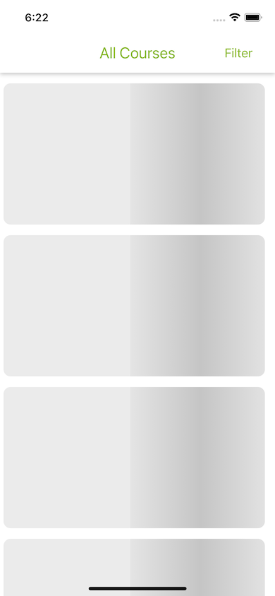
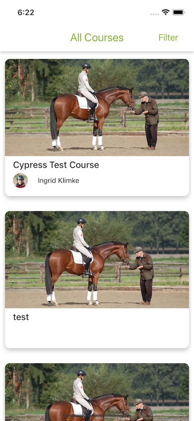
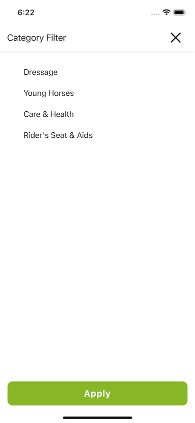
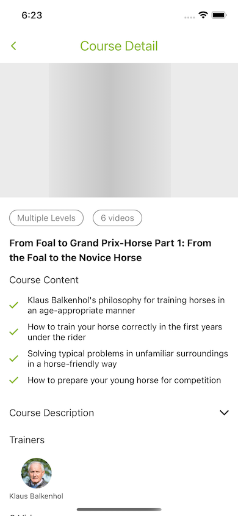
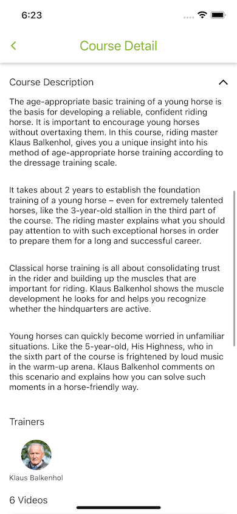
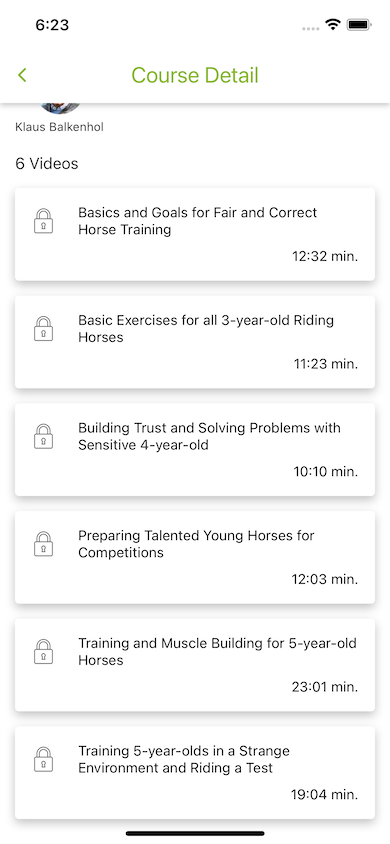
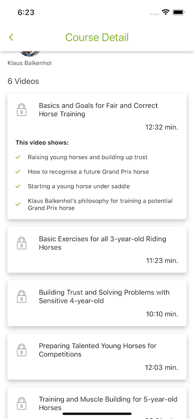

## Get Started

### 1. System Requirements

- Globally installed [node](https://nodejs.org/en/)

- Globally installed [react-native CLI](https://facebook.github.io/react-native/docs/getting-started.html)

### 2. Installation

On the command prompt run the following commands

```sh
$ git clone https://github.com/ahmetgsu/wehorse-assignment.git

$ cd wehorse-assignment/

$ npm install
  or
  yarn

$ npx pod-install ios
```

### Run on iOS

- Run `npx react-native run-ios` in your terminal

### ScreenShots
















