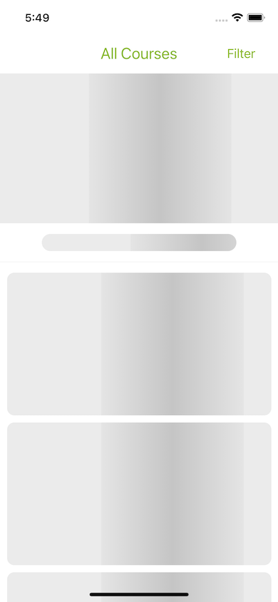
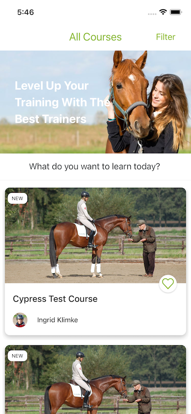
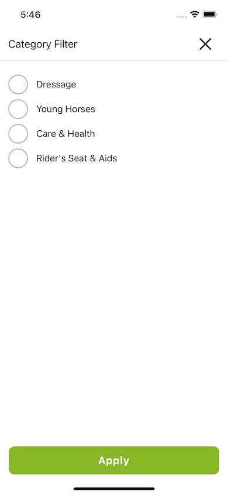
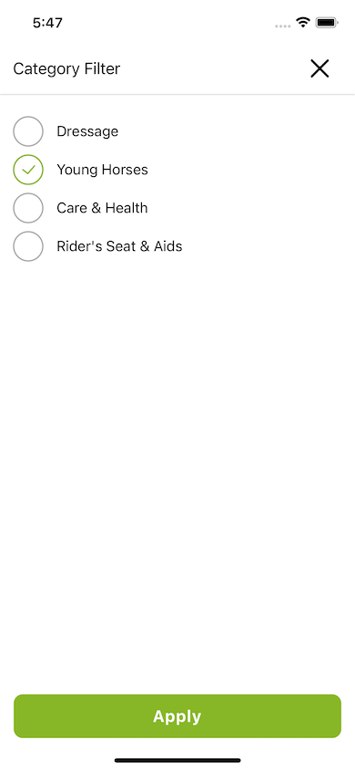
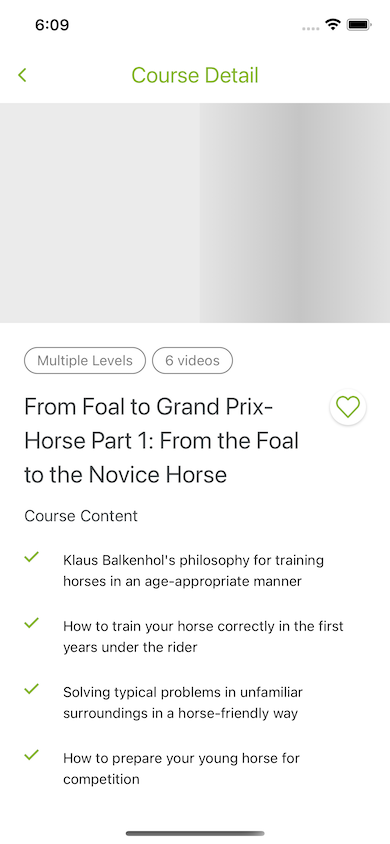
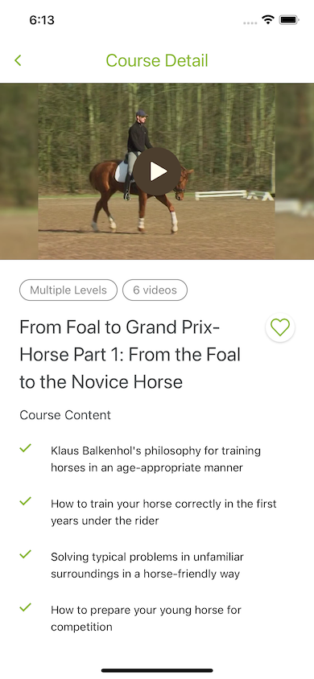
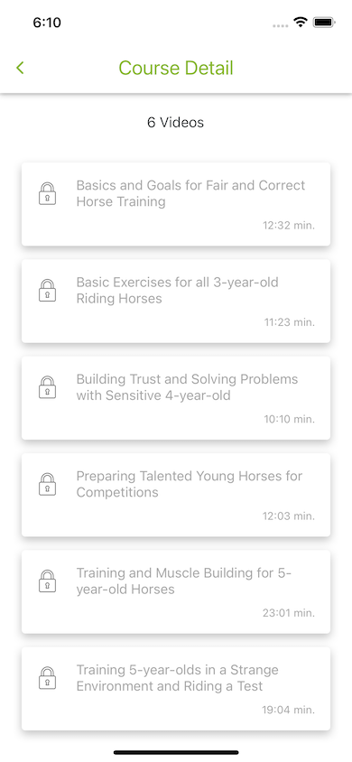
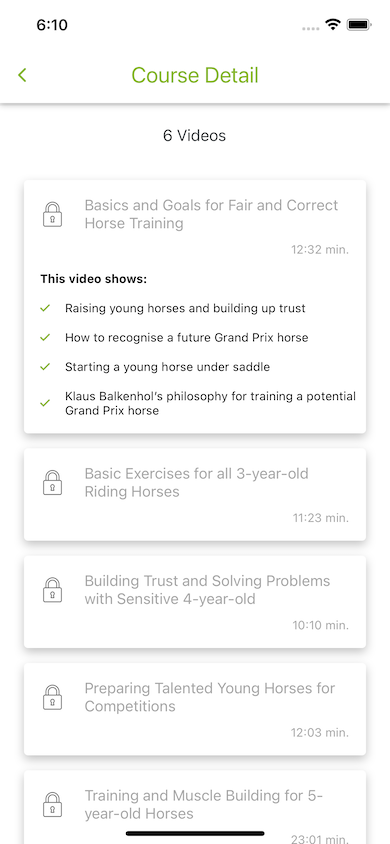

## Get Started

### 1. System Requirements

- Globally installed [node](https://nodejs.org/en/)

- Globally installed [react-native CLI](https://facebook.github.io/react-native/docs/getting-started.html)

### 2. Installation

On the command prompt run the following commands

```sh
$ git clone https://github.com/ahmetgsu/wehorse-assignment.git

$ cd wehorse-assignment/

$ yarn
  or
  npm install

  (I suggest using yarn instead of npm)

$ cd ios && pod install
```

### Run on iOS 📱

- Run `npx react-native run-ios` in your terminal, on the root folder of the project

### Aim of the project 🎯

- To make a react native application that allows users to see all available courses and the detail of a specific course.
- To dive deep into Typescript.
- To learn and implement javascript testing using Jest.
- To practice native animation feature.
- To improve user experience by adding ghost loader while course cards and video are loading.

* Users are able to filter courses according to course categories.
* Users may stream the course video on the course detail screen.

### ScreenShots

 

 

 

 

 


